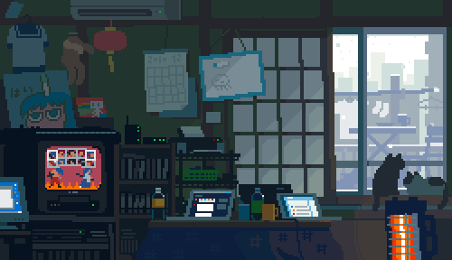

  

##

### ✨ Hi, I'm Le! / ✨ Olá, sou a Le! ✨

    
📌 I'm thirty-one years old, living in Brazil, and passionate about front-end development!

   

### About Me:

- I enjoy binge-watching series in my spare time.
- I have a keen interest in discussing topics like quantum physics, astrophysics, and electronics, but don't be surprised if we also chat about reality TV shows, series, and soap operas.

### Sobre Mim:
- Gosto de maratonar séries nas horas vagas.
- Tenho interesse em discutir tópicos como física quântica, astrofísica e eletrônica, mas não se surpreenda se também conversarmos sobre programas de TV, séries e novelas.

### Courses

📚 I am a technologist in systems analysis and development (Centro Braz Cubas).

📚📚 I am studying technical commerce (ETEC).

### Cursos

📚 Sou tecnóloga em análise e desenvolvimento de sistemas (Centro Braz Cubas).

📚📚 Estou estudando técnico em comércio (ETEC).

### Contact Information / Informações de Contato:

- Email for business inquiries / E-mail para consultas comerciais: daviny.leticia@vidal.dev.br
- Development Portfolio / Portfólio de Desenvolvimento: [www.daviny.dev](https://www.daviny.dev)
- Professional consulting website / Site profissional de consultoria: [www.davinyleticia.bio](https://www.davinyleticia.bio)

  
<h3 align="left">Languages:</h3>

<h3 align="left">Data Base:</h3>

 
 
 

<h3 align="left">Tools:</h3>

  
 
 

 
 

 

<picture>
  <source media="(prefers-color-scheme: dark)" srcset="https://raw.githubusercontent.com/davinyleticia/davinyleticia/output/github-contribution-grid-snake-dark.svg">
  <source media="(prefers-color-scheme: light)" srcset="https://raw.githubusercontent.com/davinyleticia/davinyleticia/output/github-contribution-grid-snake.svg">
  
</picture>

